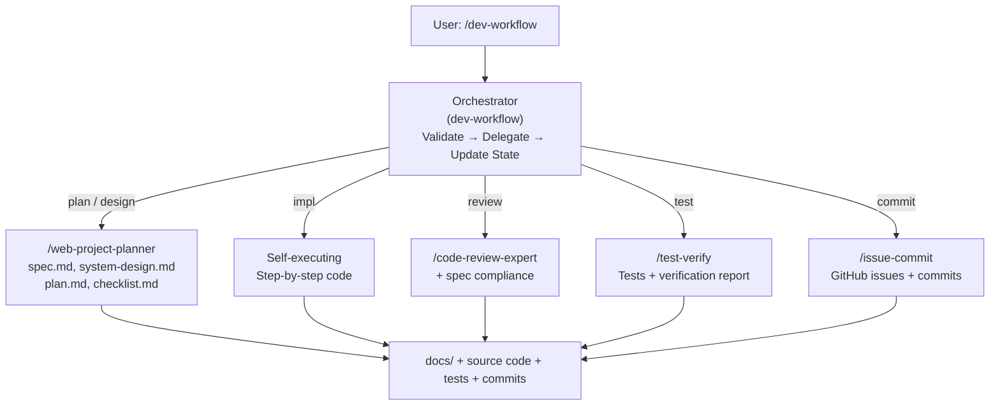
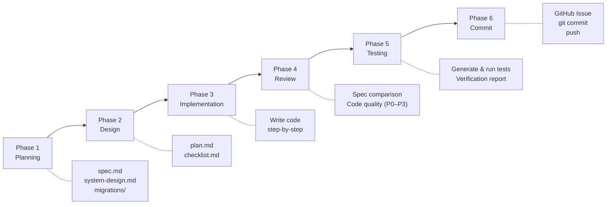
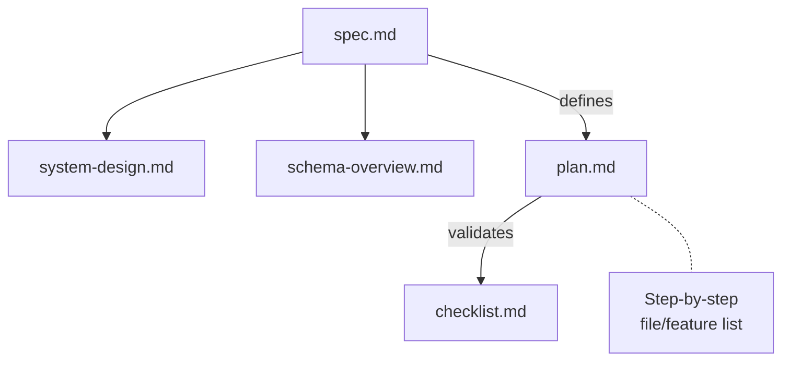

# ai-dev-workflow

**AI writes code. It doesn't enforce discipline. This workflow does.**

An opinionated, spec-driven development framework that enforces process discipline when building with AI coding assistants. Six sequential phases. No skipping. No shortcuts.

Built for [Claude Code](https://docs.anthropic.com/en/docs/claude-code) skills.

[](LICENSE)
[](CONTRIBUTING.md)

---

## The Problem

AI coding assistants generate code fast. But speed without structure creates chaos:

- **No spec verification.** AI codes before requirements are validated.
- **No deterministic progression.** Tasks jump between phases randomly. State is lost.
- **No enforced review.** Generated code ships without systematic quality checks.
- **No test mapping.** Tests are disconnected from requirements.
- **No audit trail.** No record of what was planned vs. what was built.

---

## Philosophy

| Principle | Meaning |
|-----------|---------|
| **Spec-Driven** | Every project starts with a structured specification. AI cannot satisfy requirements that don't exist. |
| **State-Tracked** | Explicit state in `workflow-state.md`. You always know which phase you're in. |
| **Sequential** | Plan → Design → Implement → Review → Test → Commit. No skipping. |
| **Review-Mandatory** | Every implementation is reviewed against the spec. P0–P3 severity ratings. |
| **Test-Mapped** | Every functional requirement maps to at least one test case. |

---

## Architecture

`/dev-workflow` is an **orchestrator** — it validates prerequisites, delegates to specialized skills, and updates state. It does not perform work directly (except implementation).



Each skill is also **independently usable** outside the workflow for existing project maintenance.

### Design Decisions

| Decision | Rationale |
|----------|-----------|
| **Markdown** | Human-readable, editable anywhere, renderable on GitHub, parseable by AI, diffable in git. |
| **Sequential phases** | Parallel phases create race conditions in requirements space. Design changes after implementation starts invalidate work. |
| **Document-driven** | Documents are portable, version-controllable, and AI-assistant-agnostic. Not tied to any runtime or platform. |
| **Orchestrator delegates** | Separation of concerns. The orchestrator handles state and sequencing. Specialized skills handle actual work. Each is independently usable. |

---

## The Six Phases



| Phase | Command | Delegates To | Output |
|-------|---------|-------------|--------|
| 1. Plan | `/dev-workflow plan` | `web-project-planner` | spec.md, system-design.md, migrations/ |
| 2. Design | `/dev-workflow design` | `web-project-planner` | plan.md, checklist.md |
| 3. Implement | `/dev-workflow impl` | — (self) | Source code |
| 4. Review | `/dev-workflow review` | `code-review-expert` | Review report (P0–P3) |
| 5. Test | `/dev-workflow test` | `test-verify` | Tests, verification report |
| 6. Commit | `/dev-workflow commit` | `issue-commit` | GitHub issues, commits, push |

> **Rule:** The previous phase's outputs must be ready before proceeding to the next phase. Status is automatically recorded in `docs/plan/workflow-state.md`.

---

## Quick Start

### Install skills

Copy skill directories into your Claude Code skills folder:

```bash
# Copy all skills at once
cp -r skills/* ~/.claude/skills/

# Or copy individual skills
cp -r skills/dev-workflow/ ~/.claude/skills/dev-workflow/
cp -r skills/web-project-planner/ ~/.claude/skills/web-project-planner/
cp -r skills/code-review-expert/ ~/.claude/skills/code-review-expert/
cp -r skills/test-verify/ ~/.claude/skills/test-verify/
cp -r skills/issue-commit/ ~/.claude/skills/issue-commit/
```

### New project (step-by-step)

```bash
/dev-workflow plan      # Phase 1: Q&A → spec, system design, migrations
/dev-workflow design    # Phase 2: implementation plan + checklist
/dev-workflow impl      # Phase 3: code step-by-step
/dev-workflow review    # Phase 4: spec compliance + code quality (P0–P3)
/dev-workflow test      # Phase 5: generate & run tests, verification report
/dev-workflow commit    # Phase 6: GitHub issues + commit + push
```

### New project (quick start)

```bash
/web-project-planner my-project  # Phase 1+2 combined: Q&A → all planning docs
/dev-workflow impl               # Phase 3: start implementation
/dev-workflow review              # Phase 4: code review
/dev-workflow test                # Phase 5: testing
/dev-workflow commit              # Phase 6: commit & push
```

### Existing project (standalone skills)

```bash
/code-review-expert     # Review current git changes
/test-verify verify     # Run existing tests + verification report
/issue-commit           # Create issues + commit + push
```

---

## Skill Reference

### `/dev-workflow` — Master Orchestrator

| Argument | Action | Delegated Skill |
|----------|--------|-----------------|
| (none), `status` | Display current workflow progress | — |
| `plan` | Phase 1: Generate spec.md, system-design.md, migrations/ | `/web-project-planner plan` |
| `design` | Phase 2: Generate plan.md, checklist.md | `/web-project-planner design` |
| `impl` | Phase 3: Sequential implementation from next incomplete step | — (self-executing) |
| `impl 4-2` | Phase 3: Implement a specific step only | — (self-executing) |
| `review` | Phase 4: Spec comparison + code review | `/code-review-expert` |
| `test` | Phase 5: Generate tests & verify | `/test-verify all` |
| `commit` | Phase 6: Create issue & commit & push | `/issue-commit` |

### `/web-project-planner` — Planning + Design

| Argument | Action |
|----------|--------|
| (none) | Full: Q&A → spec.md, system-design.md, migrations, plan.md, checklist.md |
| `plan` | Planning only: Q&A → spec.md, system-design.md, migrations |
| `design` | Design only: Read existing spec.md → plan.md, checklist.md |
| `[project-name]` | Full (uses project name as document title) |

**Execution Process:**
1. **Phase 0** — Automatic project structure analysis
2. **Phase 1** — Interactive Q&A (3 rounds: basic info → tech stack → detailed features)
3. **Phase 2** — Automatic document generation

**Generated Documents:**

| Document | Path | Mode |
|----------|------|------|
| Feature Specification | `docs/spec/spec.md` | `plan` |
| System Design | `docs/architecture/system-design.md` | `plan` |
| Schema Overview | `docs/schema/schema-overview.md` | `plan` |
| DB Migrations | `docs/schema/migrations/*.sql` | `plan` |
| Implementation Plan | `docs/plan/plan.md` | `design` |
| Verification Checklist | `docs/plan/checklist.md` | `design` |

### `/code-review-expert` — Code Review

Reviews current git changes from a senior engineer's perspective.

**Inspection Items:**
- SOLID principle violations
- Security vulnerabilities (XSS, injection, SSRF, race conditions)
- Code quality (error handling, performance, edge cases)
- Identification of code to be removed

**Severity:** P0 (Critical) → P1 (High) → P2 (Medium) → P3 (Low)

**Verdict:** APPROVE / REQUEST_CHANGES / COMMENT

### `/test-verify` — Testing & Verification

| Argument | Action |
|----------|--------|
| (none) | Ask user about scope, then generate |
| `unit` | Generate unit tests only |
| `integration` | Generate integration tests only |
| `e2e` | Generate E2E / manual verification guide |
| `all` | Generate all types |
| `verify` | Run existing tests + generate verification report based on checklist |

**Test Type Comparison:**

| Type | Scope | Example |
|------|-------|---------|
| **Unit** | Single function/component | Verify `calculateTotal()` returns correct value |
| **Integration** | Cross-module interaction | API call → data save → response return flow |
| **E2E** | Entire user scenario | Login → search → add to cart → checkout |

- Derives test scenarios from `spec.md`
- Auto-detects test framework (Vitest, Jest, Playwright, etc.)
- Includes normal/error/edge cases
- Verdict: PASS / FAIL / CONDITIONAL_PASS

### `/issue-commit` — Issue & Commit & Push

Executes 5 phases in order:

| Phase | Description |
|-------|-------------|
| PHASE 0 | `git pull` → check branch status |
| PHASE 1 | Error documentation (`errors/ERR-NNN.md`) |
| PHASE 2 | Create GitHub Issue (`gh issue create`) |
| PHASE 3 | Execute commit in English + provide Korean reference message |
| PHASE 4 | Execute `git push` after user approval |

---

## Document Output Structure

When the workflow runs, it generates documentation following this structure:

```
your-project/
└── docs/
    ├── spec/
    │   └── spec.md                        ← What to build
    ├── architecture/
    │   └── system-design.md               ← Why it was designed this way
    ├── schema/
    │   ├── schema-overview.md             ← Data structure overview
    │   └── migrations/
    │       ├── 001_initial_schema.sql
    │       ├── 002_add_indexes.sql
    │       └── ...
    └── plan/
        ├── plan.md                        ← How to build it
        ├── checklist.md                   ← Verification checklist
        └── workflow-state.md              ← Current workflow state
```

**Document Relationships:**



**Naming Conventions:**

| Target | Convention | Example |
|--------|-----------|---------|
| Markdown | lowercase-kebab-case.md | `setup-guide.md`, `api-spec.md` |
| SQL | NNN_snake_case.sql | `001_initial_schema.sql` |
| ADR | adr-NNN.md | `adr-001.md` |
| Exception | UPPERCASE at root | `README.md` |

---

## Project Structure

```
ai-dev-workflow/
├── README.md
├── LICENSE
├── CONTRIBUTING.md
├── ROADMAP.md
│
├── skills/                                # Skill definitions
│   ├── dev-workflow/SKILL.md              # Master orchestrator
│   ├── web-project-planner/SKILL.md       # Phase 1+2: planning & design
│   ├── code-review-expert/                # Phase 4: code review
│   │   ├── SKILL.md
│   │   ├── README.md
│   │   ├── agents/agent.yaml
│   │   └── references/                    # Review checklists
│   │       ├── solid-checklist.md
│   │       ├── security-checklist.md
│   │       ├── code-quality-checklist.md
│   │       └── removal-plan.md
│   ├── test-verify/SKILL.md               # Phase 5: test generation & verification
│   └── issue-commit/SKILL.md              # Phase 6: issues + commit + push
│
└── templates/                             # Document templates
    ├── spec.md                            # Feature specification
    ├── system-design.md                   # System architecture & design
    ├── plan.md                            # Implementation plan
    ├── checklist.md                       # Verification checklist
    └── workflow-state.md                  # Workflow state tracking
```

---

## Roadmap

| Version | Focus | Status |
|---------|-------|--------|
| **v0.1** | Core 6-phase workflow, skill definitions, templates | **Current** |
| **v0.2** | Configurable phase rules, custom validation hooks | Planned |
| **v0.3** | Multi-agent workflow support | Planned |
| **v0.5** | Plugin system, community skill registry | Planned |
| **v1.0** | Stable API, ecosystem maturity | Planned |

See [ROADMAP.md](ROADMAP.md) for details.

---

## Contributing

- **Found a gap?** Open an issue.
- **Better phase structure?** Propose with rationale.
- **Built a custom skill?** Submit a PR.

Read [CONTRIBUTING.md](CONTRIBUTING.md) for guidelines.

---

## Acknowledgments

- The `code-review-expert` skill was inspired by [sanyuan0704/sanyuan-skills](https://github.com/sanyuan0704/sanyuan-skills) for structured, multi-dimensional code review.

---

## License

MIT — see [LICENSE](LICENSE).

---

<p align="center">
  <strong>Don't optimize prompts. Optimize process.</strong>
</p>
