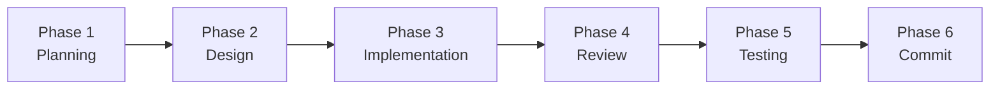
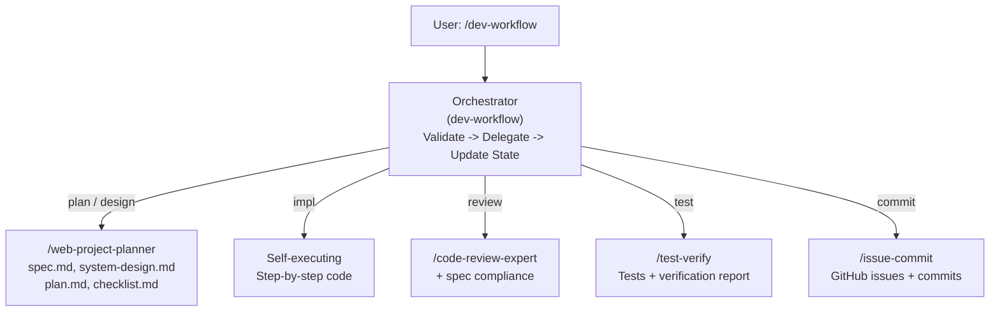

# ai-dev-workflow

**AI writes code. It doesn't enforce discipline. This workflow does.**

A spec-driven development framework that enforces process discipline when building with AI coding assistants. Six sequential phases. No skipping. No shortcuts.

Built for [Claude Code](https://docs.anthropic.com/en/docs/claude-code) skills.

[](LICENSE)
[](CONTRIBUTING.md)

---

## The Six Phases



| Phase | Command | Delegates To | Output |
|-------|---------|-------------|--------|
| 1. Plan | `/dev-workflow plan` | `web-project-planner` | spec.md, system-design.md, migrations/ |
| 2. Design | `/dev-workflow design` | `web-project-planner` | plan.md, checklist.md |
| 3. Implement | `/dev-workflow impl` | — (self) | Source code |
| 4. Review | `/dev-workflow review` | `code-review-expert` | Review report (P0–P3) |
| 5. Test | `/dev-workflow test` | `test-verify` | Tests, verification report |
| 6. Commit | `/dev-workflow commit` | `issue-commit` | GitHub issues, commits, push |

> **Rule:** The previous phase must complete before proceeding to the next. Status is tracked in `docs/plan/workflow-state.md`.

---

## Quick Start

### Install

```bash
cp -r skills/* ~/.claude/skills/
```

### New project

```bash
/dev-workflow plan      # Phase 1: Q&A -> spec, system design, migrations
/dev-workflow design    # Phase 2: implementation plan + checklist
/dev-workflow impl      # Phase 3: code step-by-step
/dev-workflow review    # Phase 4: spec compliance + code quality
/dev-workflow test      # Phase 5: generate & run tests
/dev-workflow commit    # Phase 6: GitHub issues + commit + push
```

Or combine Phase 1+2:

```bash
/web-project-planner my-project  # Phase 1+2: all planning docs at once
/dev-workflow impl               # Phase 3+
```

### Existing project (standalone skills)

```bash
/code-review-expert     # Review current git changes
/test-verify verify     # Run existing tests + verification report
/issue-commit           # Create issues + commit + push
```

---

## Architecture

`/dev-workflow` is an **orchestrator** — it validates prerequisites, delegates to specialized skills, and updates state.



Each skill is also **independently usable** outside the workflow.

---

## Document Output Structure

```
your-project/
└── docs/
    ├── spec/spec.md                    <- What to build
    ├── architecture/system-design.md   <- Why it was designed this way
    ├── schema/
    │   ├── schema-overview.md          <- Data structure overview
    │   └── migrations/*.sql
    └── plan/
        ├── plan.md                     <- How to build it
        ├── checklist.md                <- Verification checklist
        └── workflow-state.md           <- Current workflow state
```

---

## Project Structure

```
ai-dev-workflow/
├── skills/
│   ├── dev-workflow/SKILL.md           # Master orchestrator
│   ├── web-project-planner/SKILL.md    # Phase 1+2: planning & design
│   ├── code-review-expert/             # Phase 4: code review
│   │   ├── SKILL.md
│   │   └── references/                 # Review checklists
│   ├── test-verify/SKILL.md            # Phase 5: testing
│   └── issue-commit/SKILL.md           # Phase 6: issues + commit
├── templates/                          # Document templates
├── ROADMAP.md
├── CONTRIBUTING.md
└── LICENSE
```

---

## Roadmap

See [ROADMAP.md](ROADMAP.md) for details.

## Contributing

See [CONTRIBUTING.md](CONTRIBUTING.md) for guidelines.

## Acknowledgments

The `code-review-expert` skill was inspired by [sanyuan0704/sanyuan-skills](https://github.com/sanyuan0704/sanyuan-skills).

## License

MIT — see [LICENSE](LICENSE).

---

<p align="center">
  <strong>Don't optimize prompts. Optimize process.</strong>
</p>
